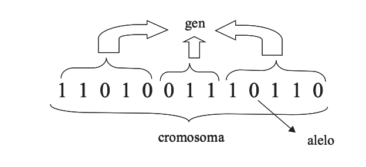
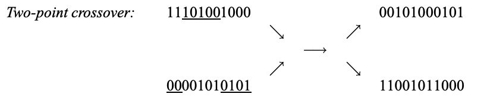

---
title: |
	
	Reporte IDO
author:
- Juanito
- Alonso
- Rebe
bibliography: refs.bib
geometry:
- margin=2cm
biblio-style: alphabetic
biblatexoptions: [backend=biber, citestyle=alphabetic]
header-includes:
  - \definecolor{backcolour}{rgb}{0.95,0.95,0.92}
  - \usepackage[ruled,vlined,linesnumbered]{algorithm2e}
  - \usepackage[utf8]{inputenc}
  - \SetKwRepeat{Do}{do}{while}
  - \usepackage{mathtools}
  - \lstset{language=Python,
	basicstyle=\ttfamily\small,
	numberstyle={\tiny \color{black}},
	backgroundcolor=\color{backcolour},
	breaklines=true,
	numbers=left,
	keywordstyle=\color{blue},
	inputencoding=utf8,
	commentstyle=\color{gray}}
...

# Marco teórico

## Formulación como problema de programación lineal

Sea $G = [g_1, g_2, \ldots, g_n]$ el \textit{genoma}. El genoma encodifica la ciudades (sus índices) y el orden que compone el recorrido. Y $C$ es el conjunto de ciudades.

\begin{equation}
    \min = \sum_{i=1}^{n-1} \| C_i - C_{i+1} \| + \| C_n - C_1 \|
\end{equation}

sujeto a:

\begin{align*}
    \sum_{i \in G} 1 = |C| \\
    g_i \neq g_j \quad \forall i \neq j
\end{align*}

## Algoritmos genéticos
Los algoritmos genéticos son algoritmos de optimización, búsqueda y aprendizaje inspirados en los procesos de evolución natural y evolución genética. La evolución es un proceso que opera sobre los cromosomas. La selección natural, expuesta en la teoría de la evolución biológica por Charles Darwin (1859), es un mecanismo que relaciona los cromosomas (genotipo) con el fenotipo (caracteres observables) y otorga a los individuos más adaptados un mayor número de oportunidades de reproducirse.
Los procesos evolutivos tienen lugar durante la etapa de reproducción, algunos de los mecanismos que afectan a la reproducción son la mutación, causante de que los cromosomas en la descendencia sean diferentes a los de los padres y el cruce que combina los cromosomas de los padres para producir una nueva descendencia.

En un algoritmo genético para alcanzar la solución a un problema se parte de un conjunto inicial de individuos, llamado población, el cual es generado de manera aleatoria. Cada uno de estos individuos representa una posible solución al problema. Se construye una función objetivo mejor conocida como función *fitness* y se definen los *adaptive landscapes*, los cuales son evaluaciones de la función objetivo para todas las soluciones candidatas. Por medio de una función de evaluación, se establece una medida numérica, la cual permite controlar en número de selecciones, cruces y copias. En general, esta medida puede entenderse como la probabilidad de que un individuo sobreviva hasta la edad de reproducción. 

### Representación
La codificación utilizada en los algoritmos genéticos es una abstracción del genotipo de los individuos. Existen varias formas de representar a los cromosomas, lo más sencilla es usar una cadena de bits. 

### Operadores genéticos
Una generación se obtiene a partir de la anterior por medio de operadores, mejor conocidos como operadores genéticos. Los más empleados son los operadores de selección, cruce, copia y mutación, los cuales vamos a utilizar en la implementación del algorítmo.

#### Selección: 
Es el mecanismo por el cual son seleccionados los individuos que serán los padres de la siguiente generación. Se otorga un mayor número de oportunidades de reproducción a los individuos más aptos. 
Existen diversas formas de realizar una selección, por ejemplo: 
1. Selección por truncamiento
2. selección por torneos
3. Selección por ruleta
4. Selección por jerarquías
Los algoritmos de selección pueden ser divididos en dos grupos: probabilísticos, en este grupo se encuentran los algoritmos de selección por ruleta, y determinísticos, como la selección por jerarquías. 
En nuestro algoritmo utilizamos la selección por ruleta, donde cada padre se elige con una probabilidad proporcional a su desempeño en relación con la población.

#### Cruce: 
Consiste en un intercambio de material genético entre dos cromosomas de dos padres y a partir de esto se genera una descendencia. Existen diversas formas de hacer un cruce, en nuestro algoritmo utilizamos el cruce de dos puntos. 

La idea principal del cruce se basa en que si se toman dos individuos correctamente adaptados y se obtiene una descendencia que comparta genes de ambos, al compartir las caracteríısticas buenas de dos individuos, la descendencia, o al menos parte de ella, debería tener una mayor bondad que cada uno de los padres. 

#### Mutación:
Una mutación en un algoritmo genético causa pequeñas alteraciones en puntos determinados de la codificación del individuo, en otras palabras, produce variaciones de modo aleatorio en un cromosoma. 
Por lo general primero se seleccionan dos individuos de la población para realizar el cruce y si el cruce tiene éxito entonces el descendiente muta con cierta probabilidad.

#### Copia:
Consiste simplemente en la copia de un individuo en la nueva generación. Un determinado número de individuos pasa directamente a la siguiente generación sin sufrir variaciones. 

A continuación presentamos el pseudocódigo del algoritmo que implementaremos. 

\begin{algorithm}[H]
\KwResult{ individuo más apto de $P_k$ }
\textbf{Inicializamos generación $0$}\;
$k \coloneqq 0$\\
$P_k \coloneqq $ población de $n$ individuos generados al azar; \\
\textbf{Evaluar} $P_k:$\\
\Do{el \underline{fitness} del individuo más apto en $P_k$ no sea lo suficientemente bueno}{
	 \textbf{Crear generación $k+1$}\;
	 \textbf{1. Copia:}\;
	 Seleccionar $ (1-\chi) \times  n$ miembros de $P_k$ e insertar en
	 $P_{k+1}$\\
	 \textbf{2. Cruce $k+1$}\;
	 Seleccionar $ \chi \times  n$ miembros de $P_k$; emparejarlos;
	 producir descendencia; insertar la descendencia en $P_{k+1}$\\
	 \textbf{3. Mutar:}\;
	 Seleccionar $ \mu \times  n$ miembros de $P_{k+1}$; invertir bits
	 seleccionados al azar \\
	 \textbf{Evaluar $P_{k+1}$}\;
	 Calcular $ fitness(i) $ para cada $ i \in P_k$\\
	 \textbf{Incrementar: $k :=k+1$}\;
}
\caption{GA($ n,\chi,\mu$) }
\end{algorithm}

$n$ es el número de individuos en la población. 
$\chi$ es la fracción de la población que será reemplazada por el cruce en cada iteración. 
$(1-\chi)$ es la fracción de la población que será copiada. 
$ \mu $ es la tasa de mutación.

En cuanto a los criterios de terminación de nuestro algoritmo, nosotros indicamos que debe detenerse cuando alcance el número de generaciones máximo especificado. 

## Vecinos más cercanos
Quiero citar a [@jaketae] asi con este comando pero no se deja.
\begin{algorithm}[H]
\KwResult{Ruta elegida con vecinos más cercanos a partir de ciudad inicial}
\textbf{Comenzamos con un conjunto de ciudades por visitar y un conjunto de visitados} \\
$c_0 \leftarrow$ ciudad elegida al azar. \\
$c_a \leftarrow c_0$ fijamos la ciudad actual. \\
$V \leftarrow \varnothing$ ciudades visitadas \\
$C \leftarrow \{ c_1, \ldots, c_n \}$ ciudades por visitar \\
\While{$|V| \neq |C|$}
{
	$V \leftarrow V \cup \{c_a \}$ \\
	$c^{*} \leftarrow \min\{d(c_a, c_i) \, | \, c_i \in C \setminus V \}$ \\
	$c_a \leftarrow c^{*}$ \\
}
\caption{Algoritmo vecinos más cercanos}
\end{algorithm}

# Resultados

# Conclusión

# Referencias
